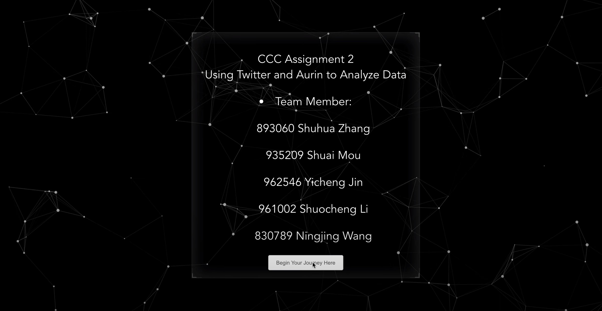

# CCC Assignment 2

This repository is designed for the Cluster and Cloud Computing Assignment 2. 


# Quick Start guide

- Clone the repository using 

  ```python
  git clone https://github.com/Mialovewatermelon/CCC-Assignment2.git
  ```

- Run the application using

  ```
  python manage.py runserver
  ```

- Run the Front-End using 

  ```
  npm run build
  ```
# Demo Picture
## Home Page


## Twitter Analysis Page


## Overall Data Analysis


## Performance Analysis

  
